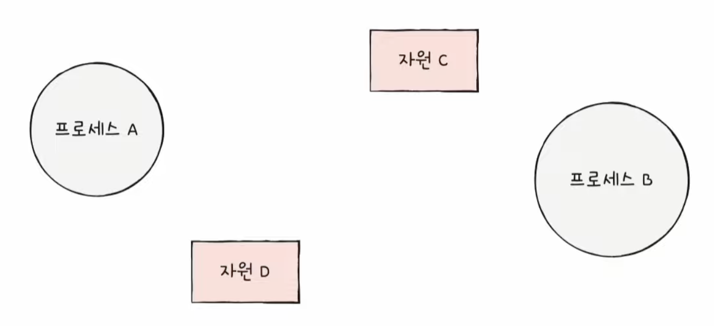

# Chapter 13. 교착 상태

  

## 13 - 1 교착 상태란

 

    Keyword : 

  

- ### 식사하는 철학자 문제
    
     

    모든 철학자들이 동시에 식사를 하게 된다면 모두 식사를 할 수 없음

  

- ### 교착 상태
    
     

    `교착 상태`

    일어나지 않을 사건들을 계속 기다리면서 진행이 멈추어 버리는 현상

    식사하는 철학자 문제는 서로가 점거하고 있는 자원을 서로가 기다리고 있을 경우에 결국에는 그 어떤 스레드나 프로세스도 끝까지 실행될 수 없음

    

    서로가 가진 자원을 할당 해제될 때까지 무작정 기다리면서 실행 한번 못하는 상황이 벌어짐

     

    이러한 교착 상태를 해결하기 위해서는

    - 교착 상태가 발생했을 때의 상황을 정확히 표현해보기

    - 교착 상태가 일어나는 근본적인 이유 이해하기

      

- ### 자원 할당 그래프
    
     

    `자원 할당 그래프`
    
    교착 상태가 발생했을 때의 상황을 표현하는 그래프

    자원 할당 그래프는 교착 상태 발생 조건을 파악 가능

    - 어떤 프로세스가 어떤 자원을 할당 받아 사용 중인지 확인 가능

    - 어떤 프로세스가 어떤 자원을 기다리고 있는지 확인 가능

     

    #### 자원 할당 그래프 그리는 법

     | 
    --- | --- | 

    첫째, 프로세스는 원으로, 자원의 종류는 사각형으로 표현

    둘째, 사용할 수 있는 자원의 개수는 자원 사각형 내에 점으로 표현

     

     | 
    --- | --- | 

    셋째, 프로세스가 어떤 자원을 할당 받아 사용 중이라면 자원에서 프로세스를 향해 화살표를 표시

    넷째, 프로세스가 어떤 자원을 기다리고 있다면 프로세스에서 자원으로 화살표를 표시

      

    

    SSD는 3개, cpu는 2개, 프린터 1개

    프로세스 a는 SSD 하나를 할당받아서 사용 중

    프로세스 b,c는 각각 cpu를 할당받아서 사용 중

    프로세스 d는 프린터를 할당받아서 사용 중

    프로세스 e는 프린터 사용을 기다리는 중

    프로세스 f는 cpu 할당을 기다리는 중

      

    

    교착 상태를 자원 할당 그래프가 원의 형태

  

- ### 교착 상태 발생 조건
    
     

    교착 상태 발생 조건

    - 상호 배제

    - 점유와 대기

    - 비선점

    - 원형 대기

    위 4가지 조건을 모두 만족하면 교착상태가 발생

     

    #### 상호 배제

    프로세스가 사용하는 자원을 다른 프로세스가 사용할 수 없는 상태

    #### 점유와 대기

    자원을 할당받은 상태에서 다른 자원을 기다리고 있는 상태

    #### 비선점

    어떤 프로세스도 다른 프로세스의 자원을 강제로 뺏지 못하는 상태

    #### 원형 대기

    자원 할당 그래프에서 원의 형태를 띄고 있는 상황

  

## 13 - 2 교착 상태 해결 방법

 

    Keyword : 

  

- ### 교착 상태 예방
    
     

    `교착 상태 예방`

    애초에 교착 상태가 발생하지 않도록 하는 방법

    교착 상태 발생 조건(상호 배제, 점유와 대기, 비선점, 원형 대기) 중 하나를 없애버리는 방식

     

    #### 상호 배제를 없애면?

    모든 자원을 공유하게 만드는 것은 이론적으로 가능하지면 현실적으로 불가능

     

    #### 점유와 대기를 없애면?

    특정 프로세스에 자원을 모두 할당하거나, 아예 할당하지 않는 방식으로 배분함으로써 `자원의 활용률을 낮출 수 있는 방식` 

     

    당장 자원이 필요한데 활용되지 못하는 프로세스, 할당을 못받고 오랫동안 기다리는 프로세스, 자원 별로 사용률이 낮은 프로세스 같이
    자원의 활용도가 너무 떨어질 수 있는 단점 존재
    
     

    #### 비선점 조건을 없애면?

    선점이 가능한 자원(CPU)에 한해 효과적

     

    But, 모든 자원이 선점 가능한 것은 아님

    예를 들어 하나의 프로세스만 사용할 수 있는 프린터를 쓰고 있는 프로세스를 뻇으면 오류가 발생

     

    #### 원형 대기 조건을 없애면?

    모든 자원에 번호를 붙이고 그 번호의 오름차순대로 자원을 할당하면 원형 대기는 발생하지 않음

    

    이것은 일렬로 된 식탁에서 식사를 하는 것과 같음

     
    
    다른 방식들보다 가장 현실적이고 실용적
    
    But, 자원에 번호를 붙이는 것은 어려운 작업

    어떤 자원에 어떤 번호를 붙이느냐에 따라 활용률이 달라짐

  

- ### 교착 상태 회피
    
     

    교착 상태를 무분별한 자원 할당으로 인해 발생했다고 간주

    교착 상태가 발생하지 않을 만큼 조금씩 할당

    배분할 수 있는 자원의 양을 고려하여 교착 상태가 발생하지 않을 만큼만 자원 배분

     

    교착 상태 회피 세가지 용어

    - 안전 순서열

    - 안전 상태

    - 불안전 상태

     

    #### 안전 순서열

    교착 상태 없이 안전하게 프로세스들에 자원을 할당할 수 있는 순서

    #### 안전 상태

    교착 상태 없이 모든 프로세스가 자원을 할당 받고 종료될 수 있는 상태

    안전 순서열이 있는 상태

    #### 불안전 상태

    교착 상태가 발생할 수도 있는 상태

    안전 순서열이 없는 상태

     

    #### 안전 순서열의 예시

    컴퓨터 시스템에 총 12개의 자원

    프로세스 P1, P2, P3가 각각 5개, 2개, 2개의 자원을 할당 받아 실행 중

    남은 배분할 수 있는 자원은 3개

    프로세스 P1, P2, P3는 각각 최대 10개, 4개, 9개의 자원을 요구할 수 있다고 가정

     

    | 프로세스 | 요구량 | 현재 사용량 |
    | --- | --- | --- |
    | P1 | 10 | 5 |
    | P2 | 4 | 2 |
    | P3 | 9 | 2 |
    
    할당 가능 자원 : 12
    
    할당한 자원 : 9

    남은 자원 : 3

    이런 상태는 안전 순서열이 존재

     

    최악의 상태를 가정하면?

    P1, P2, P3가 각각 5개, 2개, 7개를 추가로 요구했다면

    P2 -> P1 -> P3 순서대로 배분을 한다면 가능

    P2에 자원 2개를 더 할당하고 작업을 끝내고 반환 받으면
    
    남은 자원은 1 + 4 = 5개

     

    P1에 자원 5개를 더 할당하고 작업을 끝내고 반환 받으면

    남은 자원 0 + 10 = 10개

     

    나머지 P3에 자원 7개를 더 할당하면 모든 프로세스가 안전하게 종료될 수 있음

      

    | 프로세스 | 요구량 | 현재 사용량 |
    | --- | --- | --- |
    | P1 | 10 | 5 |
    | P2 | 4 | 2 |
    | P3 | 9 | 3 |
    
    할당 가능 자원 : 12
    
    할당한 자원 : 10

    남은 자원 : 2

    이런 상태는 안전 순서열이 없음

     

    최악의 상태를 가정하면?

    P1, P2, P3가 각각 5개, 2개, 6개를 추가로 요구했다면

    P2에 자원 2개를 더 할당하고 작업을 끝내고 반환 받으면
    
    남은 자원은 0 + 4 = 4개

     
    
    남은 자원은 P1, P3의 요구를 들어줄 수 없음 그래서 교착 상태 발생 위험

     

    이런 상태를 불안전 상태

  

- ### 교착 상태 검출 후 회복
    
     

    교착 상태가 발생했다는 것을 인정하고 사후에 조치하는 방식

    프로세스가 자원을 요구하면 일단 할당, 교착 상태가 검출되면 회복

    2가지 방식

    - 선점을 통한 회복

    - 프로세스 강제 종료를 통한 회복

     

    #### 선점을 통한 회복

    교착 상태가 해결될 때까지 한 프로세스씩 자원을 몰아주는 방식

     

    #### 프로세스 강제 종료를 통한 회복

    - 교착 상태에 놓인 프로세스 모두 강제 종료

        But, 작업 내역을 잃을 위험

    - 교착 상태가 해결될 때까지 한 프로세스씩 강제 종료

        But, 오버 헤드 발생 위험 