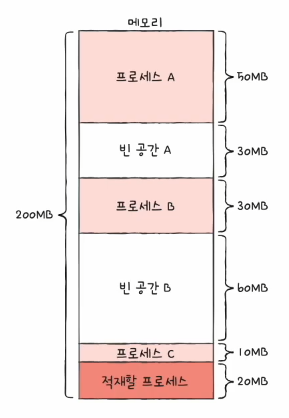

# Chapter 14. 가상 메모리

  

## 14 - 1 연속 메모리 할당

 

    Keyword : 스와핑, 최초 적합, 최적 적합, 최악 적합, 외부 단편화

  

- ### 스와핑
    
     

    메모리에 적재된 프로세스들 중에는 현재 실행되지 않는 프로세스가 있을 수 있음

    ex ) 입출력 작업의 요구로 대기 상태가 된 프로세스, 오랫동안 사용되지 않은 프로세스

     

    

    `스와핑`
    
    이런 프로세스들을 임시로 보조기억장치 일부 영역으로 보내고, 이렇게 해서 생긴 `메모리상의 빈 공간에 또 다른 프로세스를 적재하여 실행`하는 방식

     

    `스왑 영역`

    이 때 프로세스들이 보내진 보조기억장치의 일부 영역

    프로세스가 메모리에서 스왑 영역으로 옮겨지는 것을 스왑 아웃

    프로세스가 스왑 영역에서 메모리로 옮겨지는 것을 스왑 인

     

    

    스와핑을 이용하면 프로세스들이 요구하는 메모리 주소 공간의 크기가 실제 메모리 크기보다 큰 경우에도 프로세스들을 동시 실행 가능

      

- ### 메모리 할당
    
     

    메모리 내에 빈 공간이 여러 개 있다면 프로세스를 어디에다가 배치해야 할까?

    메모리 배치 3가지 방식

    - 최초 적합

    - 최적 적합

    - 최악 적합

     

     | | 
    --- | --- | --- |

    #### 최초 적합

    메모리 내의 빈 공간을 순서대로 검색하다가 적재할 수 있는 공간을 발견하면 그 공간에 프로세스 배치

    검색 최소화, 빠른 할당

    #### 최적 적합

    메모리 내의 빈 공간을 모두 검색한 후 프로세스가 적재될 수 있는 공간 중 가장 작은 공간에 프로세스를 배치

    #### 최악 적합

    메모리 내의 빈 공간을 모두 검색한 후 프로세스가 적재될 수 있는 공간 중 가장 큰 공간에 프로세스를 배치

      

- ### 외부 단편화
    
     

    

    `외부 단편화`

    프로세스들이 메모리에 연속적으로 할당되는 환경에서는 메모리 사이 사이에 빈 공간들이 생김

    이런 빈 공간보다 큰 프로세스를 적재하기 어려운 상황을 초래하고, 메모리 낭비로 이어지는 현상

     

    외부 단편화를 해결할 수 있는 대표적인 방안

    - 메모리 압축

        흩어져 있는 빈 공간을 하나로 모으는 방식

        But, 단점
        
        - 공간을 모으는 동안 시스템은 하던 일을 중단
        
        - 메모리에 있는 내용을 옮기는 작업은 많은 오버 헤드를 야기 
  
        - 어떤 프로세스를 어떻게 움직여야 오버 헤드를 최소화하며 압축할 수 있는지 명확한 방법을 결정하기 힘듬

     

    외부 단편화를 없앨 수 있는 또 다른 해결 방안이 등장했는데 이것이 오늘날까지도 사용되는 가상 메모리 기법, 그 중에서도 페이징 기법이 있음

    

    

    

    

    
    