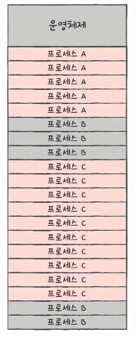
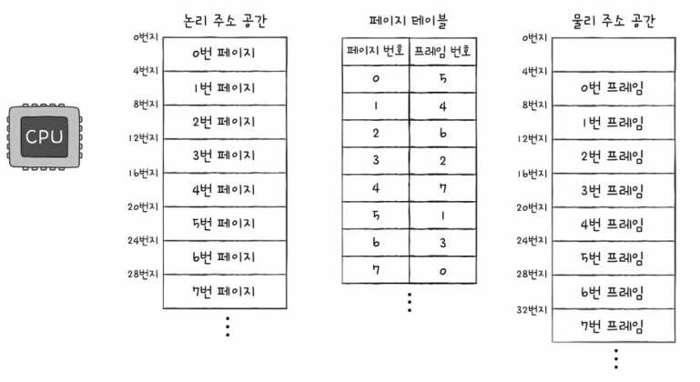

# Chapter 14. 가상 메모리

  

## 14 - 1 연속 메모리 할당

 

    Keyword : 스와핑, 최초 적합, 최적 적합, 최악 적합, 외부 단편화

  

- ### 스와핑
    
     

    메모리에 적재된 프로세스들 중에는 현재 실행되지 않는 프로세스가 있을 수 있음

    ex ) 입출력 작업의 요구로 대기 상태가 된 프로세스, 오랫동안 사용되지 않은 프로세스

     

    

    `스와핑`
    
    이런 프로세스들을 임시로 보조기억장치 일부 영역으로 보내고, 이렇게 해서 생긴 `메모리상의 빈 공간에 또 다른 프로세스를 적재하여 실행`하는 방식

     

    `스왑 영역`

    이 때 프로세스들이 보내진 보조기억장치의 일부 영역

    프로세스가 메모리에서 스왑 영역으로 옮겨지는 것을 스왑 아웃

    프로세스가 스왑 영역에서 메모리로 옮겨지는 것을 스왑 인

     

    

    스와핑을 이용하면 프로세스들이 요구하는 메모리 주소 공간의 크기가 실제 메모리 크기보다 큰 경우에도 프로세스들을 동시 실행 가능

      

- ### 메모리 할당
    
     

    메모리 내에 빈 공간이 여러 개 있다면 프로세스를 어디에다가 배치해야 할까?

    메모리 배치 3가지 방식

    - 최초 적합

    - 최적 적합

    - 최악 적합

     

     | | 
    --- | --- | --- |

    #### 최초 적합

    메모리 내의 빈 공간을 순서대로 검색하다가 적재할 수 있는 공간을 발견하면 그 공간에 프로세스 배치

    검색 최소화, 빠른 할당

    #### 최적 적합

    메모리 내의 빈 공간을 모두 검색한 후 프로세스가 적재될 수 있는 공간 중 가장 작은 공간에 프로세스를 배치

    #### 최악 적합

    메모리 내의 빈 공간을 모두 검색한 후 프로세스가 적재될 수 있는 공간 중 가장 큰 공간에 프로세스를 배치

      

- ### 외부 단편화
    
     

    

    `외부 단편화`

    프로세스들이 메모리에 연속적으로 할당되는 환경에서는 메모리 사이 사이에 빈 공간들이 생김

    이런 빈 공간보다 큰 프로세스를 적재하기 어려운 상황을 초래하고, 메모리 낭비로 이어지는 현상

     

    외부 단편화를 해결할 수 있는 대표적인 방안

    - 메모리 압축

        흩어져 있는 빈 공간을 하나로 모으는 방식

        But, 단점
        
        - 공간을 모으는 동안 시스템은 하던 일을 중단
        
        - 메모리에 있는 내용을 옮기는 작업은 많은 오버 헤드를 야기 
  
        - 어떤 프로세스를 어떻게 움직여야 오버 헤드를 최소화하며 압축할 수 있는지 명확한 방법을 결정하기 힘듬

     

    외부 단편화를 없앨 수 있는 또 다른 해결 방안이 등장했는데 이것이 오늘날까지도 사용되는 가상 메모리 기법, 그 중에서도 페이징 기법이 있음

  

## 14 - 2 페이징을 통한 가상 메모리 관리

 

    Keyword : 페이징, 페이지 테이블, PTBR, TLB

  

- ### 페이징이란
    
     

    `페이징`

    프로세스의 논리 주소 공간을 페이지라는 일정한 단위로 자르고, 메모리 물리 공간을 프레임이라는 페이지와 동일한 크기의 일정한 단위로 자른 뒤 페이지를 프레임에 할당하는 가상 메모리 관리 기법

     | 
    --- | --- | 

     

    페이징에서도 스와핑을 사용할 수 있음

    프로세스 전체가 스왑 아웃/스왑 인되는 것이 아닌 페이지 단위로 스왑 아웃/스왑 인

    프로세스를 이루는 페이지 중 실행에 필요한 일부 페이지만 메모리에 적재하고, 당장 실행에 필요하지 않은 페이지들은 보조기억장치에 남겨두는 방식

     

    

     

- ### 페이지 테이블
    
     

    But, 프로세스가 메모리에 불연속적으로 배치되어 있다면 CPU는 '다음에 실행할 명령어 위치'를 찾기 힘듬

     

    `페이지 테이블`

    프로세스가 비록 물리 주소(실제 메모리 내의 주소)에 불연속적으로 배치되더라도 논리 주소(CPU가 바라보는 주소)에는 연속적으로 배치되도록 사용하는 테이블

    페이지 번호와 프레임 번호를 짝지어 주는 일종의 이정표

     

    

    
     
     

    `페이지 테이블 베이스 레지스터(PTBR)`

    CPU 내에서 각 프로세스의 페이지 테이블이 적재된 주소를 가리키는 레지스터

    프로세스 A 실행 -> PTBR은 프로세스 A의 페이지 테이블을 가리킴 -> CPU는 A의 페이지 테이블을 통해 프로세스 A의 페이지가 적재된 프레임을 알 수 있음

    각 프로세스들의 페이지 테이블 정보는 각 프로세스의 PCB에 기록

     
     

    But, 페이지 테이블을 메모리에 두면 메모리 접근 시간이 두 배로 늘어남

    메모리에 있는 페이지 테이블을 보기 위해 1번, 그렇게 알게 된 프레임에 접근하기 위해 1번

     
     

    `TLB(Translation Lookaside Buffer)`

    이와 같은 문제를 해결하기 위해 CPU 근처에(일반적으로 MMU 내부) TLB라는 페이지 테이블의 캐시 메모리를 둠

    TLB는 페이지 테이블의 캐시이기에 페이지 테이블의 일부 내용을 저장하고 참조 지역성에 근거해 최근에 사용된 페이지 위주로 가져와 저장

     

    논리 주소에 대한 페이지 번호가 TLB에 있으면 TLB 히트

    없으면 TLB 미스

     
    
- ### 페이징에서의 주소 변환
    
     

    하나의 페이지 혹은 프레임은 여러 주소를 포괄

    그렇기에 특정 주소에 접근하려면 두 가지 정보가 필요

    - 어떤 페이지 혹은 프레임에 접근하고 싶은지

    - 접근하려는 주소가 그 페이지 혹은 프레임으로부터 얼마나 떨어져 있는지

     

    페이징 시스템에서는 모든 논리 주소가 기본적으로 페이지 번호와 변위로 이루어져 있음

    CPU가 32비트 주소로 내보냈다면 이 중 N비트는 페이지 번호, 32-N비트는 변위

     

    페이지 번호

    접근하고자 하는 페이지 번호

     

    변위

    접근하려는 주소가 프레임의 시작 번지로부터 얼만큼 떨어져 있는지를 알기 위한 정보

     

    

    예제

    CPU가 5번 페이지, 변위 2라는 논리 주소에 접근하고 싶어한다면?

    1. 페이지 테이블을 볼 때 5번 페이지는 현재 1번 프레임에 있음

    2. CPU는 물리 주소 공간의 1번 프레임, 변위 2에 접근
    
    3. 1번 프레임은 8번지부터 시작하고 8 + 2(변위) 즉, CPU는 10번지에 접근
    
     
    
- ### 페이지 테이블 엔트리
    
     

    `페이지 테이블 엔트리`

    페이지 테이블의 각각의 행

    페이지 번호, 프레임 번호 뿐만 아니라 유효 비트, 보호 비트, 참조 비트, 수정 비트도 들어 있음

    #### 유효 비트

    현재 해당 페이지에 접근 가능한지 여부를 알려줌

    일반적으로 프로세스를 이루는 모든 페이지가 메모리에 있지 않고, 보조기억장치(스왑영역)에 있는 경우가 많음

     

    즉, 유효 비트는 현재 페이지가 메모리에 적재되어 있는지 아니면 보조기억장치에 있는지를 알려주는 비트

     

    메모리에 적재되어 있다면 1, 아니면 0

    유효 비트가 0인 페이지에 접근하려고 하면 페이지 폴트라는 예외가 발생

    페이지 폴트 처리 과정
    
    CPU는 기존 작업 내역을 백업 -> 페이지 폴트 처리 루틴을 실행 -> 원하는 페이지를 메모리로 가져온 뒤 유효 비트를 1로 변경 -> CPU는 해당 페이지에 접근

      

    #### 보호 비트

    페이지 보호 기능을 위해 존재하는 비트

    읽고 쓰기가 가능한 페이지면 1, 읽기만 가능한 페이지면 0

    r(읽기), w(쓰기), x(실행)의 조합으로 나타낼 수도 있음

      

    #### 참조 비트

    CPU가 해당 페이지에 접근한 적이 있는지 여부를 나타내는 비트

    적재 이후 CPU가 읽거나 쓴 페이지는 1, 아니면 0

      

    #### 수정 비트

    해당 페이지에 데이터를 쓴 적이 있는지 없는지 수정 여부를 알려주는 비트

    변경된 적이 있는 페이지면 1, 아니면 0

     

    페이지가 메모리에서 사라질 때 보조기억장치에 쓰기 작업을 해야 하는지, 아닌지를 알기 위해 존재

    CPU는 메모리에 값을 쓰기도 하기 때문에 수정 비트가 1이면 보조기억장치에 저장된 페이지의 내용과 다른 값을 가지고 있다는 의미이기에 변경된 값을 기록해야 함

  

## 14 - 3 페이지 교체와 프레임 할당

 

    Keyword : 요구 페이징, 페이지 교체 알고리즘, 스레싱, 프레임 할당

  

- ### 요구 페이징
    
     

    `요구 페이징`

    프로세스를 메모리에 적재할 때 처음부터 모든 페이지를 적재하지 않고 필요한 페이지만을 메모리에 적재하는 기법

    실행에 요구되는 페이지만 적재하는 기법

     

    요구 페이징의 순서

    1. CPU가 특정 페이지에 접근하는 명령어를 실행

    2. 해당 페이지가 메모리에 있을 경우(유효 비트가 1) CPU는 페이지가 적재된 프레임에 접근

    3. 해당 페이지가 메모리에 없을 경우(유효 비트가 0) 페이지 폴트 발생

    4. 페이지 폴트 처리 루틴은 해당 페이지를 메모리로 적재하고 유효 비트를 1로 설정

    5. 다시 1번을 수행

      

    아무런 페이지도 메모리에 적재하지 않은 채 무작정 실행도 가능

    `순수 요구 페이징`
    
    프로세스가 첫 명령어를 실행하는 순간부터 페이지 폴트가 계속 발생하고 실행에 필요한 페이지가 어느 정도 적재된 이후부터는 페이지 폴트 발생 빈도가 떨어짐

      

    요구 페이징 시스템이 안정적으로 작동하려면 2가지를 해결해야 함

    - 페이지 교체

    - 프레임 할당

    요구 페이징 기법으로 페이지들을 적재하다 보면 언젠가 메모리가 가득 차게 됨

     
    
    그러면 어떤 페이지를 내보내는 것이 최선일까?

    페이지 교체 알고리즘을 이용

      

- ### 페이지 교체 알고리즘
    
     
    
    페이지 폴트를 가장 적게 일으키는 알고리즘이 좋은 페이지 교체 알고리즘

    Why?

    페이지 폴트가 일어나면 보조기억장치로부터 필요한 페이지를 가져와야 하기 때문에 메모리에 적재된 페이지를 가져오는 것보다 느려지기 때문

     

    페이지 폴트가 자주 발생하는 것은 내보내면 안되는 페이지를 보조기억장치로 내보냈다는 뜻

    그렇기에 페이지 교체 알고리즘을 제대로 이해하려면 페이지 폴트 횟수를 알 수 있어야 함

    이는 페이지 참조열을 통해 알 수 있음

     

    페이지 참조열

    CPU가 참조하는 페이지들 중 연속된 페이지를 생략한 페이지열

    예제

    CPU가 아래와 같은 순서로 페이지에 접근했다면

    2 2 2 3 5 5 5 3 3 7

    여기서 연속된 페이지를 생략한 페이지열이 페이지 참조열

    2 3 5 3 7

     

    연속된 페이지를 생략하는 이유는 중복된 페이지를 참조하는 것은 페이지 폴트를 발생시키지 않기 때문

      

    #### FIFO 페이지 교체 알고리즘

    메모리에 가장 먼저 올라온 페이지부터 내쫓는 알고리즘

     

    

      

    #### 최적 페이지 교체 알고리즘

    CPU에 참조되는 횟수를 고려하는 알고리즘

    즉, 앞으로 사용 빈도가 가장 낮은 페이지를 교체하는 알고리즘

    하지만 앞으로 사용하지 않을 페이지를 예측하기는 쉽지 않기에 실제 구현이 어려움 
    
    그래서 타 알고리즘의 성능 평가를 위한 목적으로 사용

     

    

      

    #### LRU 페이지 교체 알고리즘

    가장 오랫동안 사용되지 않은 페에지를 교체하는 알고리즘

     

    

      

- ### 스래싱과 프레임 할당
    
     

    프로세스가 사용할 수 있는 프레임 수가 적어도 페이지 폴트는 자주 발생

    `스래싱`

    프로세스가 실제 실행되는 시간보다 페이징에 더 많은 시간을 소요하여 성능이 저해되는 문제

     

    

      

    스래싱을 그래프로 표현하면

    

    멀티프로그래밍의 정도
    
    메모리에서 동시에 실행되는 프로세스의 수

    멀티프로그래밍의 정도가 높다면 현재 메모리에는 많은 프로세스가 동시에 실행중

    낮으면 반대

     

    그래프를 보면 멀티프로그래밍의 정도를 늘린다고 해서 CPU 이용률이 비례해서 증가하는 것은 아님

    필요 이상으로 늘리면 각 프로세스들이 사용할 수 있는 프레임 수가 적어져 페이지 폴트가 빈번하게 발생하고 이에 따라 CPU 이용률이 떨어져 전체적인 성능이 저해

    CPU의 성능이 좋아도 물리 메모리가 작다면 전체 컴퓨터의 성능이 안좋아지는 이유

     

    스래싱이 발생하는 근본적인 원인은?

    각 프로세스가 필요로 하는 최소한의 프레임 수가 보장되지 않았기 때문

    그렇기에 운영체제는 각 프로세스들이 무리 없이 실행하기 위한 최소한의 프레임 수를 파악하고 프로세스들에 적절한 수만큼 프레임을 할당해 줄 수 있어야 함

      

    #### 균등 할당

    가장 단순한 형태의 프레임 할당 방식

    예를 들어 3개의 프로세스에 300개의 프레임을 할당할 수 있다면 각 프로세스에 100개의 프로세스를 할당

    But, 프로세스들의 크기가 각기 다른데 같은 프레임 개수를 할당하는 것은 비합리적

     

    #### 비례 할당

    프로세스의 크기에 따라 할당해주는 프레임 할당 방식

    But, 하나의 프로세스가 실제로 얼마나 많은 프레임이 필요할지는 결국 실행해봐야 알기에 완벽한 방식 X

      

    배분할 프레임을 결정하는 방식

    - 작업 집합 모델 사용 방식

    - 페이지 폴트 빈도 사용 방식

      

    #### 작업 집합 모델 사용 방식

    스래싱 발생 이유는 빈번한 페이지 교체 때문이기에 프로세스가 일정 기간 동안 참조한 페이지 집합을 기억하여 이를 방지

    CPU는 참조 지역성의 원리에 의거해 비슷한 구역을 집중적으로 참조

    실행 중인 프로세스가 일정 시간 동안 참조한 페이지의 집합을 작업 집합이라고 함

    운영 체제는 작업 집합의 크기만큼만 프레임을 할당해주면 됨

     

    #### 페이지 폴트 빈도 사용 방식

    2가지의 가정

    - 페이지 폴트율이 너무 높으면 그 프로세스는 너무 적은 프레임을 가지고 있음

    - 페이지 폴트율이 너무 낮으면 그 프로세스는 너무 많은 프레임을 가지고 있음

     

    

    
    페이지 폴트율이 상한선보다 더 높아지면 프레임을 더 할당해주고

    하한선보다 더 낮아지면 프레임을 회수

    즉, 페이지 폴트 빈도 기반 프레임 할당 방식은 페이지 폴트율에 상한선과 하한선을 정하고, 이 범위 안에서만 프레임을 할당하는 방식

    

    

    

    
    