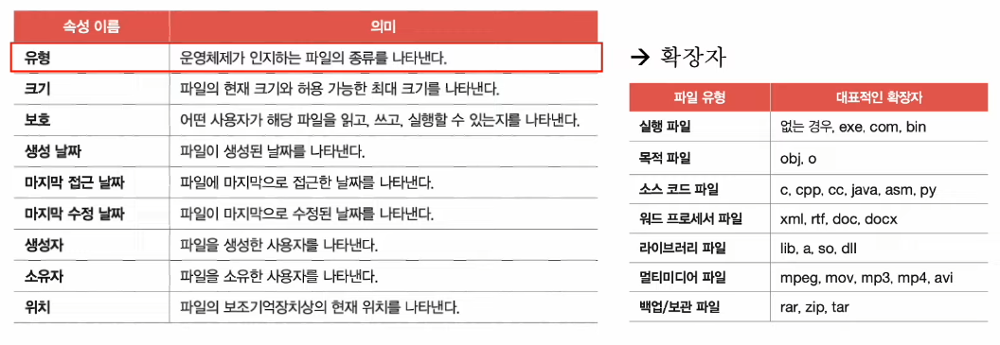
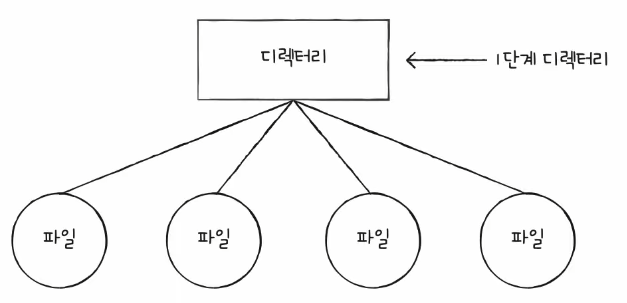
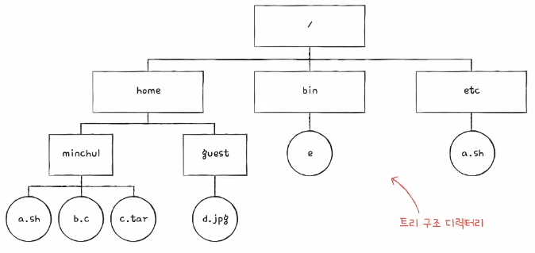

# Chapter 15. 파일 시스템

  

## 15 - 1 파일과 디렉터리

 

    Keyword : 파일, 확장자, 속성, 디렉터리, 경로, 절대 경로, 상대 경로

  

- ### 파일
    
     

    `파일`

    하드 디스크나 SSD와 같은 보조기억장치에 저장된 관련 정보의 집합

    모든 파일에는 이름과 파일을 실행하기 위한 정보, 파일 관련 부가 정보가 있는데 이를 속성 또는 메타데이터라고 부름

    임의의 파일에서 마우스 오른쪽 버튼을 클릭한 후 [속성]을 선택하면 나오는 정보가 파일 속성

      

    #### 파일 속성과 유형

    대표적인 속성의 종류와 유형

    

    파일 유형

    운영체제가 인식하는 파일 종류

    파일 유형을 알리기 위해 가장 흔히 사용하는 방식은 확장자를 이용하는 것
    
      

    #### 파일 연산을 위한 시스템 호출

    파일을 다루는 모든 작업은 운영체제에 의해 이뤄짐

    운영체제는 파일 연산을 위한 시스템 호출을 제공

    - 파일 생성, 상제, 열기, 닫기, 읽기, 쓰기

  

- ### 디렉터리
    
     

    파일들을 일목요연하게 관리하기 위해 디렉터리를 이용

    윈도우에서는 디렉터리를 폴더라고 부름

     

    

    과거 운영체제는 모든 파일이 하나의 디렉터리 아래에 있었음

    이를 1단계 디렉터리라고 부름

     

    

    이후 파일이 많아지면서 여러 계층을 가진 트리 구조 디렉터리가 생겨나게 됐음

    그러다 보니 디렉터리를 이용해 파일 위치, 파일 이름을 특정 짓는 정보인 경로라는 개념이 생김

     

    #### 절대 경로와 상대 경로

    `절대 경로`

    루트 디렉터리에서 자기 자신까지 이르는 고유한 경로

    `상대 경로`

    현재 디렉터리부터 시작하는 경로

     

     #### 디렉터리 연산을 위한 시스템 호출

    운영체제는 디렉터리 연산을 위한 시스템 호출 제공

    - 디렉터리 생성, 삭제, 열기, 닫기, 읽기

     

    #### 디렉터리 엔트리

    디렉터리도 파일

    디렉터리는 내부에 해당 디렉터리에 담겨 있는 대상과 관련된 정보를 담고 있음

    디렉터리 엔트리를 보면 해당 디렉터리에 무엇이 담겨 있는지, 보조기억장치의 어디에 있는지 알 수 있음

    

