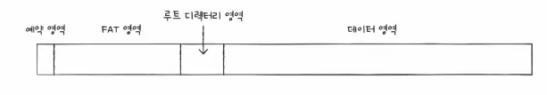
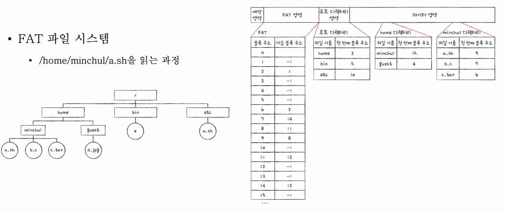
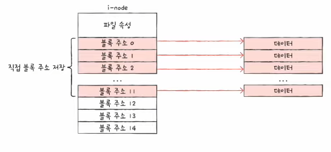
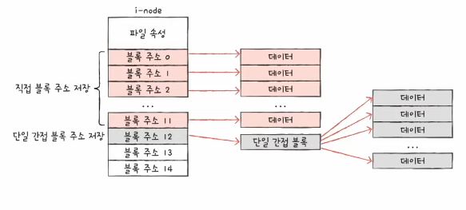
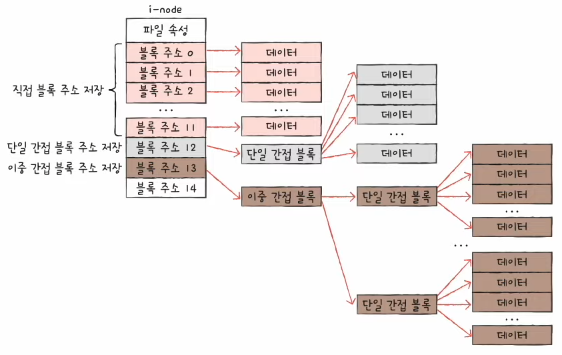
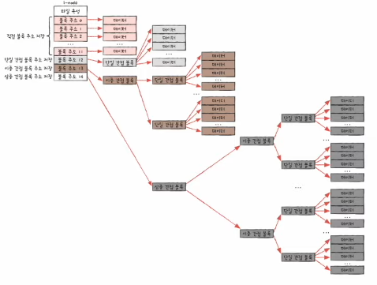
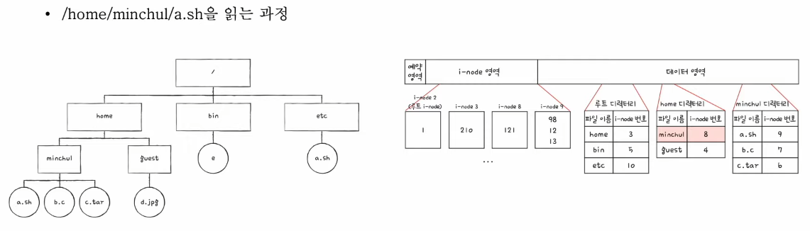

# Chapter 15. 파일 시스템

  

## 15 - 1 파일과 디렉터리

 

    Keyword : 파일, 확장자, 속성, 디렉터리, 경로, 절대 경로, 상대 경로

  

- ### 파일
    
     

    `파일`

    하드 디스크나 SSD와 같은 보조기억장치에 저장된 관련 정보의 집합

    모든 파일에는 이름과 파일을 실행하기 위한 정보, 파일 관련 부가 정보가 있는데 이를 속성 또는 메타데이터라고 부름

    임의의 파일에서 마우스 오른쪽 버튼을 클릭한 후 [속성]을 선택하면 나오는 정보가 파일 속성

      

    #### 파일 속성과 유형

    대표적인 속성의 종류와 유형

    

    파일 유형

    운영체제가 인식하는 파일 종류

    파일 유형을 알리기 위해 가장 흔히 사용하는 방식은 확장자를 이용하는 것
    
      

    #### 파일 연산을 위한 시스템 호출

    파일을 다루는 모든 작업은 운영체제에 의해 이뤄짐

    운영체제는 파일 연산을 위한 시스템 호출을 제공

    - 파일 생성, 상제, 열기, 닫기, 읽기, 쓰기

  

- ### 디렉터리
    
     

    파일들을 일목요연하게 관리하기 위해 디렉터리를 이용

    윈도우에서는 디렉터리를 폴더라고 부름

     

    

    과거 운영체제는 모든 파일이 하나의 디렉터리 아래에 있었음

    이를 1단계 디렉터리라고 부름

     

    

    이후 파일이 많아지면서 여러 계층을 가진 트리 구조 디렉터리가 생겨나게 됐음

    그러다 보니 디렉터리를 이용해 파일 위치, 파일 이름을 특정 짓는 정보인 경로라는 개념이 생김

     

    #### 절대 경로와 상대 경로

    `절대 경로`

    루트 디렉터리에서 자기 자신까지 이르는 고유한 경로

    `상대 경로`

    현재 디렉터리부터 시작하는 경로

     

     #### 디렉터리 연산을 위한 시스템 호출

    운영체제는 디렉터리 연산을 위한 시스템 호출 제공

    - 디렉터리 생성, 삭제, 열기, 닫기, 읽기

     

    #### 디렉터리 엔트리

    디렉터리도 파일

    디렉터리는 내부에 해당 디렉터리에 담겨 있는 대상과 관련된 정보를 담고 있음

    디렉터리 엔트리를 보면 해당 디렉터리에 무엇이 담겨 있는지, 보조기억장치의 어디에 있는지 알 수 있음

  

## 15 - 2 파일 시스템

 

    Keyword : 파티셔닝, 포매팅, 연속 할당, 연결 할당, 색인 할당, FAT 파일 시스템, 유닉스 파일 시스템

  

- ### 파티셔닝과 포매팅
    
     

    보조기억장치를 사용하려면 파티션을 나누는 작업(파티셔닝)과 포맷 작업(포매팅)을 거쳐야 함

    `파티셔닝`

    저장 장치의 논리적인 영역을 구획하는 작업

    하드 디스크나 SSD처럼 용량이 큰 저장 장치를 하나 이상의 논리적인 단위로 구획하는 것

    이런 파티셔닝 작업을 통해 나눠진 영역 하나하나를 파티션이라고 함

      

    `포매팅`

    파일 시스템을 설정하여 어떤 방식으로 파일을 저장하고 관리할 것인지를 결정하고, 새로운 데이터를 쓸 준비를 하는 작업

  

- ### 파일 할당 방법
    
     

    운영체제는 파일과 디렉터리를 블록 단위로 읽고 씀

    즉, 하나의 파일이 보조기억장치에 저장될 때는 하나 이상의 블록에 걸쳐 저장

     

    파일을 보조기억장치에 할당하는 2가지 방법

    - 연속 할당 

    - 불연속 할당

        - 연결 할당
        
        - 색인 할당
  
     

    #### 연속 할당

    보조기억장치 내 연속적인 블록에 파일을 할당하는 방식

    구현이 단순하지만 외부 단편화(14챕터의 가상 메모리 참고)를 야기하는 치명적인 문제

      

    #### 연결 할당

    각 블록 일부에 다음 블록의 주소를 저장하여 각 블록이 다음 블록을 가리키는 형태로 할당하는 방식

    즉, 데이터를 연결 리스트로 관리

    연속 할당의 문제를 해결할 수 있는 방식

     

    But, 
    
    - 반드시 첫 번째 블록부터 하나씩 읽어야 함

    -  하드웨어 고장이나 오류 발생시 해당 블록 이후 블록은 접근할 수 없음

    이는 성능 면에서 상당히 비효율적

      

    #### 색인 할당

    파일의 모든 블록 주소를 색인 블록이라는 하나의 블록에 모아 관리하는 방식

    색인 블록 안에 파일을 구성하는 데이터 블록 주소가 있으므로 색인 블록만 알면 해당 파일 데이터에 접근 가능

    그래서 색인 할당을 사용하는 파일 시스템에서는 디렉터리 엔트리에 색인 블록 주소를 명시

    이를 기반으로 만든 시스템이 유닉스 파일 시스템

      

- ### 파일 시스템 살펴보기
    
     

    파일 시스템은 크게 2가지

    - USB, SD 카드 등 저용량 저장 장치에 사용되는 `FAT 파일 시스템`

    - 유닉스 계열 운영체제에서 사용되는 `유닉스 파일 시스템`

     

    #### FAT 파일 시스템

    연결 할당의 단점을 보완한 파일 시스템

    `파일 할당 테이블(File Allocation Table)`
    
    각 블록에 포함된 다음 블록의 주소들을 한데 모아 테이블 형태로 관리

    FAT을 이용하는 파일 시스템이 FAT 파일 시스템

      

    

    

    FAT는 파티션의 앞부분에 만들어짐

    FAT는 하드 디스크 파티션의 시작 부분에 있지만, 실행하는 도중 FAT가 메모리에 캐시될 수 있음

    FAT가 메모리에 적재된 채 실행되면 임의 접근의 성능이 개선

      

    #### FAT 파일 시스템에서 파일을 읽는 과정

    

 

    1. 루트 디렉터리를 확인 후 home 디렉터리의 블록 위치 확인

    2. home 디렉터리를 확인 후 minchul 디렉터리의 블록 위치 확인

    3. minchul 디렉터리를 확인 후 a.sh 디렉터리의 블록 위치 확인

    4. FAT를 보고 a.sh는 9, 8, 11, 13 블록 순서로 저장되어 있다는 것을 확인 후 파일 시스템은 9, 8, 11, 13 블록에 접근

      

    #### 유닉스 파일 시스템

    색인 할당 기반의 파일 시스템

    유닉스 파일 시스템에서는 색인 블록을 i-node라고 부름

      

    i-node에는 파일 속성 정보와 15개의 블록 주소가 저장될 수 있음

    FAT 파일 시스템에서는 파일 속성 정보가 디렉터리 엔트리에 표현되었지만, 유닉스 파일 시스템에서는 i-node에 표현

      

    파일마다 i-node를 가지고 있고 번호를 가지고 있음

    i-node들은 파티션 내 특정 영역에 모여 있음

    But, i-node의 크기는 유한하고 하나당 15개의 블록을 가리킬 수 있기 때문에 블록을 많이 차지하는 파일은 i-node 하나만으로는 파일의 데이터 블록을 가리킬 수 없음

      

    #### 해결 방법
    
    

 

    1. 블록 주소 중 12개에는 직접 블록 주소를 저장

        직접 블록은 파일 데이터가 저장된 블록

     

    

 

    2. 1로 충분하지 않다면 13번째 주소에 단일 간접 블록 주소를 저장

        단일 간접 블록은 파일 데이터를 저장한 블록 주소가 저장된 블록

     

    

 

    3. 2로 충분하지 않다면 14번째 주소에 이중 간접 블록 주소를 저장

        이중 간접 블록은 단일 간접 블록들의 주소가 저장된 블록

     

    

 

    4. 3로 충분하지 않다면 15번쨰 주소에 삼중 간접 블록 주소를 저장

        삼중 간접 블록은 이중 간접 블록들의 주소가 저장된 블록

      

    #### 유닉스 파일 시스템에서 파일을 읽는 과정

    

 

    1. 루트 i-node에 접근하여 루트 디렉터리의 위치 파악

    2. 루트 디렉터리에서 home의 i-node 번호 파악

    3. 3번 i-node에 접근하여 home 디렉터리 위치 파악

    4. 210번 블록을 읽고 home 디렉터리에 들어가서 minchul의 i-node 번호 파악

    5. 8번 i-node에 접근하여 minchul 디렉터리 위치 파악

    6. 121번 블록을 읽고 minchul 디렉터리에 들어가서 a.sh의 i-node 번호 파악

    7. 9번 i-node에 접근하여 a.sh 위치 파악

      

    이외 파일 시스템은 윈도우에서 사용되는 NT 파일 시스템, 리눅스에서 사용되는 ext 파일 시스템이 있음
