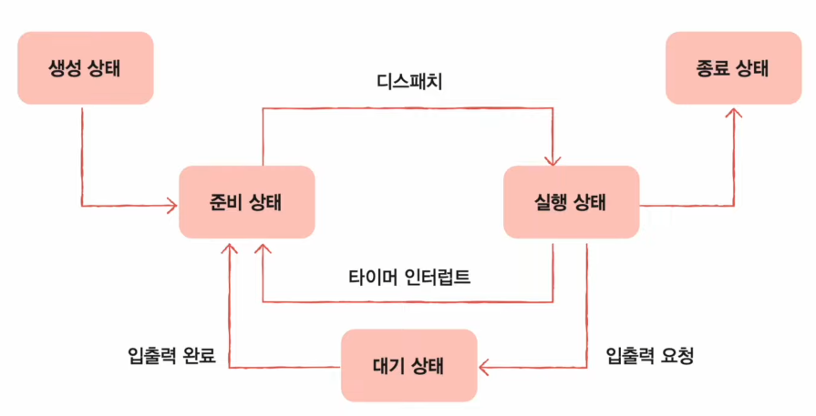

# 운영체제 정리

  

# 운영체제

- 운영체제란?

    실행할 프로그램에 필요한 자원을 할당하고, 프로그램이 올바르게 실행되도록 돕는 특별한 프로그램

 

- 메모리 내 커널 영역과 사용자 영역 중 커널 영역에 위치

 

-  `커널`은 운영체제의 핵심 기능을 담당

 

- CPU는 `사용자 모드`와 `커널 모드`를 번갈아 전환하며 운영체제 서비스를 제공 받음

 

- 운영체제의 핵심 서비스
    
    - 프로세스 관리

    - 자원 접근 및 할당

    - 파일 시스템 관리

 

### 질문

- 운영체제에 대해 설명

    > 프로그램에 자원을 할당하고, 실행을 돕는 특별한 프로그램이며, 메모리 내에 커널 영역에 위치

   

# 프로세스

## 프로세스와 스레드

- 프로세스란?

    실행중인 프로그램

 

- 운영체제는 프로세스의 실행 순서를 관리하고 프로세스에 자원을 분배하기 위해 `프로세스 제어 블록(PCB)`을 이용

 

- PCB에 기록되는 정보를 `문맥`이라고 하고 이 문맥들을 백업하고 복구하여 프로세스를 실행하는 것을 `문맥 교환`이라고 함

 

- 프로세스는 코드, 데이터, 힙, 스택 영역으로 나뉘어 저장

 

 
    
- 프로세스는 `생성, 준비, 실행, 대기, 종료 상태`를 거치며 실행

 

- 프로세스가 프로세스를 낳는 `프로세스 계층 구조`로 프로세스들을 관리 

 

- 스레드란?

    프로세스를 구성하는 실행 흐름 단위로 하나의 프로세스가 한 번에 여러 일을 동시에 처리할 수 있게 함

 

- 프로세스의 자원(스택, 힙, 데이터, 코드 영역)을 공유하며 실행하는 것이 스레드의 핵심

 

- 여러 프로세스를 동시에 실행하는 것을 멀티프로세스, 여러 스레드로 프로세스를 동시에 실행하는 것을 멀티 스레드

### 질문

- PCB에 대해서 설명

    > PCB는 프로세스의 정보가 담긴 블록이며, 이것을 사용하여 프로세스가 중지되거나 실행될 때, 백업하고 복구하는 문맥 교환이 일어남

 

- 프로세스 상태에 대해서 설명

    > 프로세스는 생성, 준비, 실행, 대기, 종료 상태를 거치며 실행

 

- 스레드에 대해서 설명

    > 스레드는 프로세스를 구성하는 실행 흐름 단위, 프로세스의 자원(스택, 힙, 데이터, 코드 영역)을 공유하며 실행

   

## CPU 스케줄링

- CPU 스케줄링이란?

     운영체제가 프로세스들에게 CPU 자원을 배분하는 것

 

- 프로세스는 `우선순위`를 가지고 있으며 PCB에 적혀 있음

 

- 효율적인 스케줄링을 위해 `스케줄링 큐`를 사용하고 준비 큐와 대기 큐가 있음

 

- 하나의 프로세스가 자원을 사용하고 있을 때, 다른 프로세스가 해당 자원을 뺏을 수 있는 스케줄링을 `선점형 스케줄링`, 뺏을 수 없는 스케줄링을 `비선점형 스케줄링`이라고 함

 

- 스케줄링 알고리즘의 종류

    - 선입 선처리 스케줄링(FCFS) - 비선점형

        - 준비 큐에 삽입된 순서대로

         

    - 최단 작업 우선 스케줄링(SJF) - 비선점형이나 선점형일수도 있음

        - CPU 사용 시간이 짧은 프로세스부터
        
         

    - 라운드 로빈 스케줄링 - 선점형

        - 타임 슬라이스 이용

         

    - 최소 잔여 시간 우선 스케줄링(SRT) - 선점형

        - SJF + RR

         

    - 우선순위 스케줄링

        - 기아 현상을 방지하기 위해 에이징 기법 사용

         

    - 다단계 큐 스케줄링

        - 우선순위별 큐를 여러 개 사용

        - 큐별 다른 스케줄링 알고리즘 사용 가능

          

    - 다단계 피드백 큐 스케줄링

        - 다단계 큐 스케줄링 + 에이징 기법

 ### 질문

- 선점형, 비선점형 스케줄링에 대해서 설명

    > 하나의 프로세스가 자원을 사용하고 있을 때, 다른 프로세스가 해당 자원을 뺏을 수 있는 스케줄링을 `선점형 스케줄링`, 뺏을 수 없는 스케줄링을 `비선점형 스케줄링`이라고 함

 

- 각 스케줄링 알고리즘에 대해서 설명

   

## 프로세스 동기화

- 프로세스 동기화란?

    특정 자원에 접근할 때 한 개의 프로세스만 접근하게 하거나, 프로세스를 올바른 순서대로 실행하게 하는 것

 

- 공유 자원이란?

    공동의 자원, 전역 변수, 파일, 입출력장치, 보조기억장치 등

 

- 동시에 실행하면 문제가 발생하는 자원에 접근하는 코드 영역을 `임계 구역`이라고 함

 

- 두 개 이상의 프로세스가 임계 구역에 진입하고자 하면 하나는 대기해야 하며, 먼저 진입한 프로세스의 작업이 마무리 되면 기다린 프로세스가 진입할 수 있음

 

- 레이스 컨디션이란?

    잘못된 실행으로 여러 프로세스가 동시에 임계 구역 코드를 실행하여 문제가 발생하는 것

 

- 뮤텍스 락을 통해 임계 구역을 잠금으로써 프로세스 간의 상호 배제를 이룸

 

- 세마포를 통해 공유 자원이 여러 개 있는 임계 구역 문제도 해결할 수 있음

 

- 모니터는 상호 배제를 위한 큐와 조건 변수에 대한 큐를 나눠 모니터 안에는 항상 하나의 프로세스만 들어올 수 있게끔하는 동기화 도구

 ### 질문

- 프로세스 동기화에 대해서 설명

    > 특정 자원에 접근할 때 한 개의 프로세스만 접근하게 하거나, 프로세스를 올바른 순서대로 실행하게 하는 것

 

- 임계 구역에 대해서 설명

    > 동시에 실행하면 문제가 발생하는 자원에 접근하는 코드 영역

   

## 교착 상태

- 교착 상태란?

    일어나지 않을 사건을 기다리며 진행이 멈춰 버리는 현상

 

- 교착 상태 발생 조건

    - 상호 배제

        - 자원을 한 번에 하나의 프로세스만 이용 가능

    - 점유와 대기

        - 자원을 할당받은 상태에서 다른 자원을 할당 받기를 기다림

    - 비선점

        - 다른 프로세스의 자원을 뻇을 수 없음

    - 원형 대기

        - 원의 형태로 자원을 대기

 

- 교착 상태 예방은 교착 상태 발생 조건 중 하나를 충족하지 못하게 하는 방법

 

- 교착 상태 회피는 안전 순서열대로 자원을 배분하여 안전 상태를 유지할 때만 자원을 할당하는 방법

    - 안전 순서열 : 교착 상태 없이 안전하게 프로세스들에 자원을 할당할 수 있는 순서

    - 안전 상태 : 안전 순서열대로 자원을 배분하여 교착 상태가 발생하지 않는 상태

 

- 교착 상태 검출 후 회복은 교착 상태 발생을 인정하고 사후에 조치하는 방법

### 질문

- 교착 상태 발생 조건에 대해서 설명

   

# 메모리

## 메모리 관리

- 스와핑이란?
    
     메모리에서 사용되지 않는 일부 프로세스를 보조기억장치로 내보내고 실행할 프로세스를 메모리로 들여보내는 메모리 관리 기법

 

- 비어있는 메모리 공간에 프로세스를 할당하는 방식

    - 최초 적합

    - 최적 적합

    - 최악 적합

 

- 외부 단편화란?

    작은 메모리 공간들로 인해 메모리가 낭비되는 현상

    압축을 통해 해결할 수 있지만 오버헤드(프로그램 처리를 하지 않는 시간, 메모리)가 발생

 

-  페이징이란?

    외부 단편화 해결을 위한 또 다른 방법으로, 한 프로세스를 실행하기 위해 프로세스 전체가 메모리에 적재될 필요가 없기 때문에
    
    메모리의 물리 주소 공간을 `프레임` 단위로 자르고 프로세스 논리 주소 공간을 `페이지` 단위로 자른 뒤 각 페이지를 프레임에 할당하는 가상 메모리 관리 기법

 

- `페이지 테이블`의 페이지 번호와 변위를 이용해 불연속적으로 배치된 페이지가 적재된 프레임을 찾을 수 있음

 

- 페이지 테이블을 보기 위한 메모리 접근 시간을 줄이기 위해 TLB라는 캐시 메모리를 사용

 

- 요구 페이징이란?

    실행에 필요한 페이지만 적재하는 기법

 

- 페이지 교체 알고리즘이란?

    가득찬 메모리에서 어떤 페이지를 내보낼지 결정하는 방법

 

- 페이지 교체 알고리즘 종류

    - FIFO

        적재된 페이지 순서대로 교체

    - 최적 페이지 교체 알고리즘

        오랫동안 사용하지 않을 페이지를 교체

        But, 앞으로 어떤 부분을 참조할지 모르기에 현실적으로 불가능

    - LRU 페이지 교체 알고리즘

        오랫동안 사용하지 않은 페이지를 교체

 

- 스래싱이란?

    프로세스가 실제 실행되는 시간보다 페이징에 더 많은 시간을 소요하여 성능이 저해되는 문제

 

- 운영체제는 스래싱 발생 위험을 줄이기 위해 프로세스들이 무리 없이 실행하기 위한 최소한의 프레임 수를 파악하고 그것을 할당해줄 수 있어야 함

 

- 프레임 할당 방식

    - 균등 할당

    - 비례 할당

    - 작업 집합 모델

        실행 중인 프로세스가 일정 시간 동안 참조한 페이지의 집합의 크기만큼만 프레임을 할당

    - 페이지 폴트 빈도

        페이트 폴트 비율의 상한선과 하한선을 구하고 그 내부 범위 안에서만 프레임을 할당

 

### 질문

- 가상 메모리를 어떻게 사용하는지에 대해서 설명

    > 스와핑을 이용해서 사용

 

- 페이징에 대해서 설명

    > 메모리의 물리 주소 공간을 `프레임` 단위로 자르고 프로세스 논리 주소 공간을 `페이지` 단위로 자른 뒤 각 페이지를 프레임에 할당하는 가상 메모리 관리 기법 

   

# 파일 시스템

- 파일이란?

    의미 있고 관련 있는 정보를 모은 논리적 단위

 

- 파일의 확장자를 통해 파일의 유형을 파악

 

- 디렉터리를 이용하여 여러 개의 파일 또는 디렉터리를 묶어 관리

 

- 절대 경로는 루트 디렉터리부터 시작하는 경로이고, 상대 경로는 현재 디렉터리부터 시작하는 경로

 

- 파일 시스템이란?

    파일과 디렉터리를 보조기억장치에 저장하고 접근할 수 있게 하는 운영체제 내부 프로그램

 

- 파티셔닝과 포매팅을 통해 구획을 나누고 파일 시스템을 결정

 

- 파일 할당 방법

    - 연속 할당

        - 연속적인 블록에 파일을 할당

        - 외부 단편화 야기

    - 연결 할당

        - 블록에 다음 블록 주소를 저장

        - 반드시 첫번째 블록부터 읽어야 하며, 오류 발생 시 접근 불가

    - 색인 할당

        - 색인 블록이라는 하나의 블록에 모아 관리

     

    - 파일 시스템의 종류

        - FAT 파일 시스템

            다음 블록 주소를 모아 테이블 형태로 관리(File Allocation Table)

        - 유닉스 파일 시스템

            i-node라는 색인 블록 사용

            i-node는 15개의 블록 주소만 저장 가능

 

### 질문

- 파일 시스템에 대해서 설명

    > 파일과 디렉터리를 보조기억장치에 저장하고 접근할 수 있게 하는 운영체제 내부 프로그램

